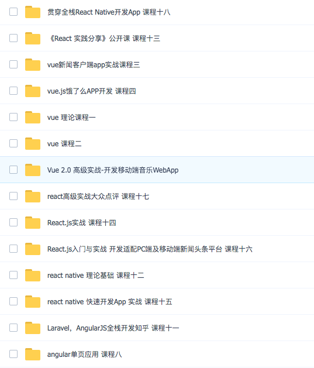
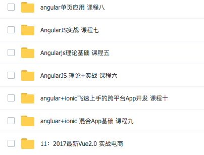

<h1 align="center">慕课网资源汇总</h1>

持续更新中。。。

大家尽快下载，可能被封

资源从各个渠道搜集而来，希望大家珍惜

最后，如果觉得好，那就star吧，(*^▽^*)

## 综合
- https://mp.weixin.qq.com/s/R-PDIKnWXS5KA0PIaaXvrA
- 三大框架 链接: https://pan.baidu.com/s/1GIn5NCd5RB5-n_14Q_5lPg 密码: kuse
  
  
- 传智博客内部视频各种前端基础大讲解  链接:https://pan.baidu.com/s/1pKQqFDT  密码:pnmr

## es6
- ECMAScript6.0视频 链接:https://pan.baidu.com/s/1dGl5YCD  密码:8oul
- 

## 小程序

- 链接:https://pan.baidu.com/s/1Z8GsCgfLP-xApIpdY-zJOQ 密码:1mp1
- 小程序  链接：https://pan.baidu.com/s/1pLBn1kJ 密码：xi10
## angular
- Angular 4.0从入门到实战 打造在线竞拍网站  链接：https://pan.baidu.com/s/1c14tTc 密码：BK71

## react
- 链接：https://pan.baidu.com/s/1mhPp2Ko 密码：hgwv

React.js入门与实战 开发适配PC端及移动端新闻头条平台

React Native快速开发厕所在哪App等

React.js模仿大众点评webapp

- react高级实施大众点评 链接: http://pan.baidu.com/s/1i4NkzYH 密码: 9jcz 

## vue
- Vue2.0入门+实战  http://pan.baidu.com/share/link?shareid=3601009151&uk=312039504 

## ionic
- 快速上手Ionic3 多平台开发企业级问答社区   https://pan.baidu.com/s/1mhYJOFI     cx1a

## css
- CSS3入门到精通  链接:https://pan.baidu.com/s/1jIXjiIy 密码:mr3r

## html5
- HTML5从入门到精通  链接:https://pan.baidu.com/s/1snuRFn3 密码:rc36

## 后端
- EasySwoole+ElasticSearch打造高性能小   链接:https://pan.baidu.com/s/1chJTMHlAMsnIax9Ek4k2MQ 提取码:5e2m
- 2小时学会Springboot 链接：https://pan.baidu.com/s/1eGKUDA6EYC9HRFz4RIgUjA   提取码：2me8 
- Java全套视频集锦  https://pan.baidu.com/s/1325jTM4zN4DFsHpbuqfmZQ  9qu1
- java架构师从入门到精通  https://pan.baidu.com/s/1z7WNiMPaEsSQKXaqZ5cJSA 提取码：zbba
- Java秒杀系统方案优化 高性能高并发实战 https://pan.baidu.com/s/1qZ1zo4k 密码：bA98

